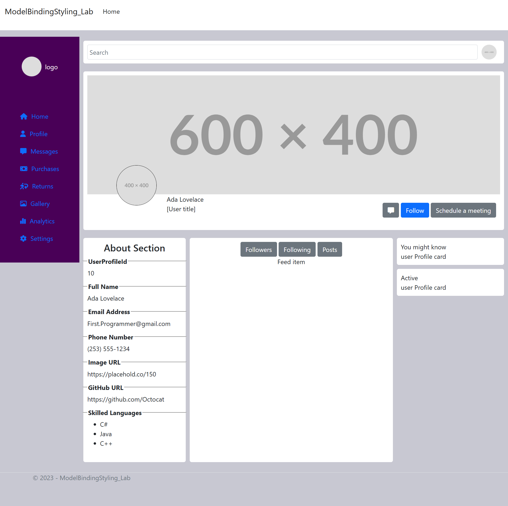

# CPW219-ModelBinding Styling Lab
Starter code for lab activity. Your task is to change the UserProfile page and 3D printer list pages and style them. You can
use custom CSS or a framework like Bootstrap

