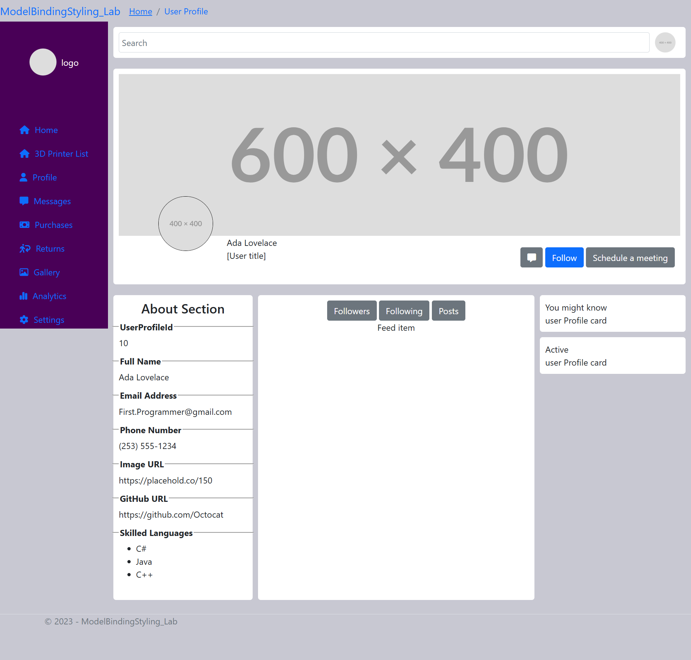
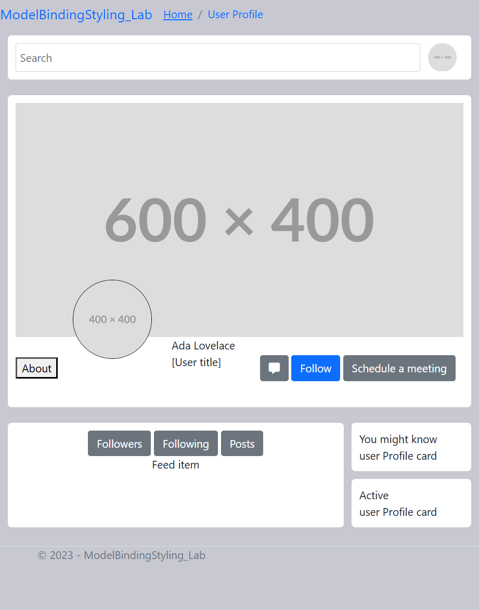
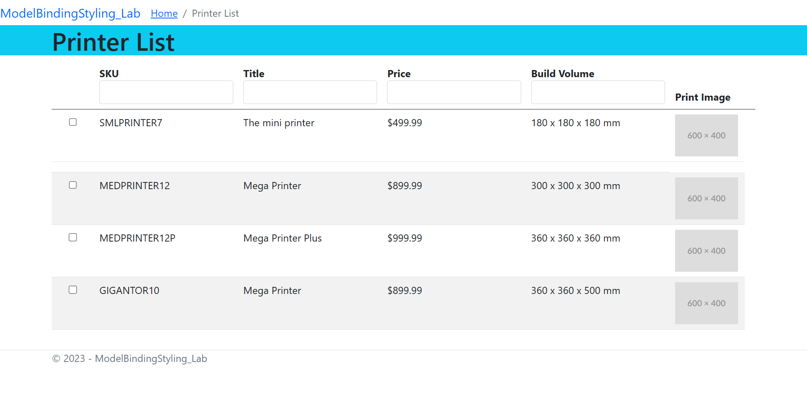
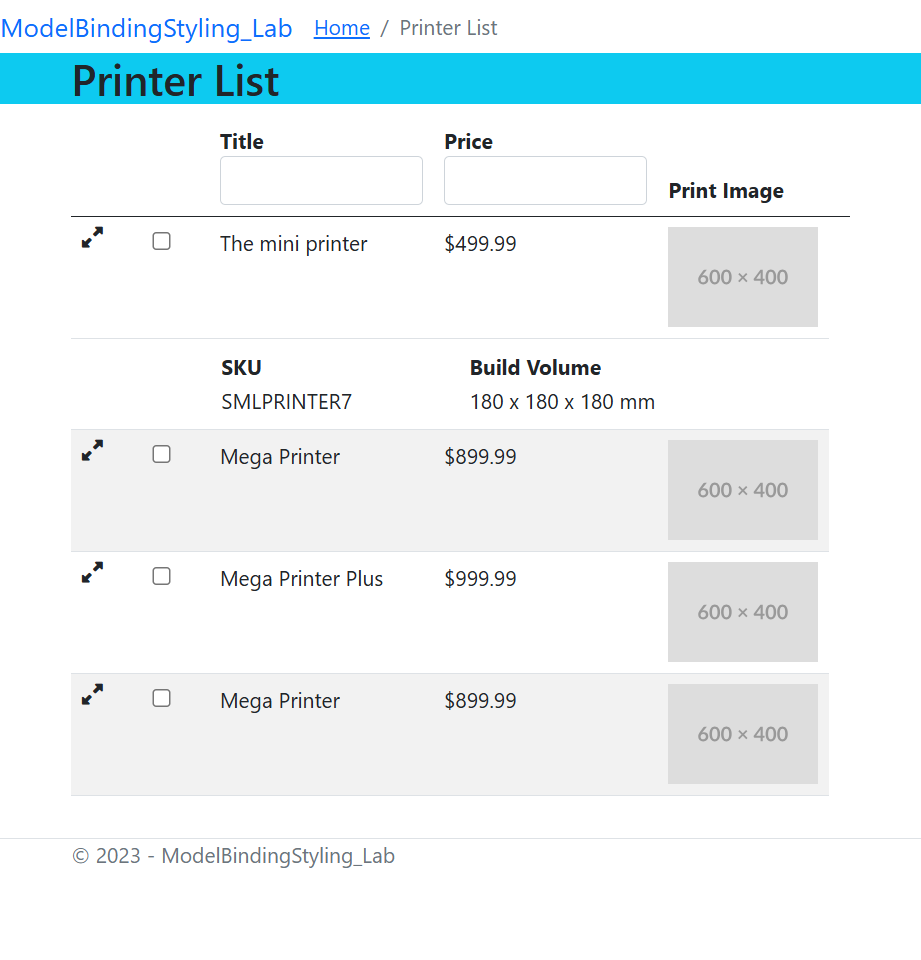

# CPW219-ModelBinding Styling Lab

This project is meant to practice using HTML/CSS/JS/Bootstrap/ASP.NET. Also to get practice with using Github workflows: Issues/Merging to Main/Linking PRs with Issues.

I used the Breadcrumb Bootstrap component in the header, Bootstrap buttons, and Bootstrap media queries, along with a custom styling and html.

## User Profile

I worked on building out a user profile page to be similar to social media platforms. The account-nav on the left is "sticky" and follows the users scroll position. But this element is hidden on small screens. The about section becomes a modal (Not yet implemented).

## Printer List

The printer list tables, I tried to implement features of a js library called DataTables. I have used the library extensively, and comes with alot of great features out of the box, but the library abstracts too much away from the html. However, I have been able to inspect the html DataTables creates.

So this was an attempt to implement search boxes by column, and also implement child tables for mobile screens. It was exciting to do this, but I'd probably stick with DataTables for another project. 

